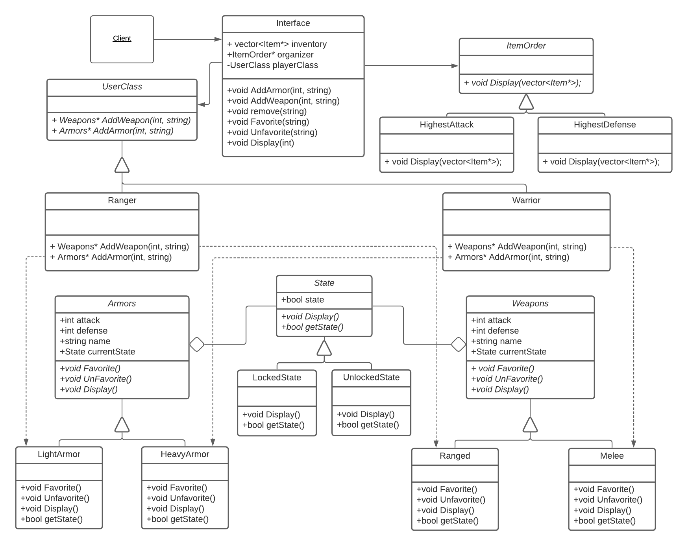

 > As you complete each section you **must** remove the prompt text. Every *turnin* of this project includes points for formatting of this README so keep it clean and keep it up to date. 
 > Prompt text is any lines beginning with "\<"
 > Replace anything between \<...\> with your project specifics and remove angle brackets. For example, you need to name your project and replace the header right below this line with that title (no angle brackets). 
# Game Inventory
 > Your author list below should include links to all members GitHub and should begin with a "\<" (remove existing author).
 
 > Authors: [Abanob Wahba](https://github.com/Abanob21),[Kirby Vong](https://github.com/Kirby-Vong), and [Nathan Lee](https://github.com/nlee096).
 
 > You will be forming a group of **THREE** students and work on an interesting project that you will propose yourself (in this `README.md` document). You can pick any project that you'd like, but it needs ot implement three design patterns. Each of the members in a group is expected to work on at least one design pattern and its test cases. You can, of course, help each other, but it needs to be clear who will be responsible for which pattern and for which general project features.
 
 > ## Expectations
 > * Incorporate **three** distinct design patterns, *two* of the design patterns need to be taught in this course:
 > * Composite, Strategy, Abstract Factory, Visitor
 > * All three design patterns need to be linked together (it can't be three distinct projects)
 > * Your project should be implemented in C/C++. If you wish to choose anoher programming language (e.g. Java, Python), please discuss with your lab TA to obtain permission.
 > * You can incorporate additional technologies/tools but they must be approved (in writing) by the instructor or the TA.
 > * Each member of the group **must** be committing code regularly and make sure their code is correctly attributed to them. We will be checking attributions to determine if there was equal contribution to the project.

## Project Description
 > Your project description should summarize the project you are proposing. Be sure to include
 > * Why is it important or interesting to you?\
 > Game inventory to add and sort items based on their attack and defense power to help players with full inventory items.
 > * What languages/tools/technologies do you plan to use? (This list may change over the course of the project)
 > * [toolname](link) - Short description\
 > For this project we will be using C++ as the primary language.

 > * What will be the input/output of your project?\
 > *The input will be game items such as weapons and armor stats.\
 > *The output will be sorted items based on the attack and defense and locked items, which will be at the top.

 > * What are the three design patterns you will be using. For each design pattern you must:
 > * Explain in 3 - 5 sentences why you picked this pattern and what feature you will implement with it\
 > *Abstract Factory : Using the Abstract Factory design pattern, varying collectable game objects can be easily created based on the character class of the user. The user will be able to add items to their inventory by inputting the classification (weapons, armor) and the related stats, which will be stored and ready to be organized. Using an abstract factory allows the user to input a variety of items based on the users class while allowing them to be compared for sorting.\
 >*Strategy : Strategy uses algorithms to sort items and organize items in an order. This will show players the essential items in the order of best to worst. Using these algorithms, items with the highest attack and defense power will be on top, which will help players see them and effectively use them to win the game.\
 > *State : The State design pattern will be used in our program to lock items into a state where they will never be removed. This will be useful to the user in case they have a specific item that regardless of its properties, they want to keep. The states will be labeled as Favorite or Unfavorited allowing them to be displayed differently based on their “state.” The implementation of this design pattern will make it easier to add these features to our program.\

 > * This description should be in enough detail that the TA/instructor can determine the complexity of the project and if it is sufficient for the team members to complete in the time allotted. 

 > ## Phase II
 > In addition to completing the "Class Diagram" section below, you will need to 
 > * Set up your GitHub project board as a Kanban board for the project. It should have columns that map roughly to 
 >   * Backlog, TODO, In progress, In testing, Done
 >   * You can change these or add more if you'd like, but we should be able to identify at least these.
 > * There is no requirement for automation in the project board but feel free to explore those options.
 > * Create an "Epic" (note) for each feature and each design pattern and assign them to the appropriate team member. Place these in the `Backlog` column
 > * Complete your first *sprint planning* meeting to plan out the next 7 days of work.
 >   * Create smaller development tasks as issues and assign them to team members. Place these in the `Backlog` column.
 >   * These cards should represent roughly 7 days worth of development time for your team, taking you until your first meeting with the TA
 
## Class Diagram
 > Include a class diagram(s) for each design pattern and a description of the diagram(s). This should be in sufficient detail that another group could pick up the project this point and successfully complete it. Use proper OMT notation (as discussed in the course slides). You may combine multiple design patterns into one diagram if you'd like, but it needs to be clear which portion of the diagram represents which design pattern (either in the diagram or in the description). 
 
 OMT Class Diagram:
 > 
 
 Class Diagram description:
 > * Interface:
 > The interface’s job is to store the vector of weapons and armors while also providing a way for the user to interact with the features of the program. The user will input a number corresponding to their class so that the items they create will correspond to their class. It also holds vectors for weapon and armor pointers to keep track of all the items the user puts in or removes. It also stores a pointer to UserClass so that the user can create items based on their class through the interface. Through the interface, the user can add/remove armor and weapons, favorite and unfavorite items, and display their inventory in order of highest attack or defense.   

> * UserClass:
> 	The item’s within our program use the Abstract Factory design pattern by allowing the user to create items based on their specific class. The abstract UserClass class has a subclass system in which there are 2 classes (Ranger and Warrior) to choose from and the item created will be based on that. The abstract factory is the UserClass class while the concrete factories are the Ranger and Warrior subclasses. These classes have 2 functions to add weapons and armors, which will create light/heavy armors and ranged/melee weapons based on which concrete class is used and return a pointer to it. The user will be able to input the stat number, which will be interpreted as attack or defence based on the item. Users will also have to give a name to the item they are creating.

> * Armors / Weapons:
> 	Armors and Weapons are abstract product classes that have subclasses LightArmor and HeavyArmor, and Ranged and Melee respectively. Whenever the factory class runs the function AddWepons() or AddArmors(), a new weapon or armor is created based on which concrete factory is used. Furthermore, the items that are created will be set to a default unlocked state. All items are stored as pointers in the interface class. All subclasses have functions Favorite, Unfavorite, and Display as well as getter functions for state, attack and defence stats.. The Favorite function changes the state to locked while the Unfavorite function changes it to unlocked. However the display function calls the display function in the State class as Display() will behave differently depending on the state of the item. This is also true for getState().

> * ItemOrder:
> 	ItemOrder uses the strategy design pattern by having subclasses that order and display the vector of items differently depending on user input. ItemOrder is an abstract parent class that has 2 subclasses HighestAttack and HighestDefence each with their own implementation of the pure virtual function called display. HighestAttack’s display will order the vector with items with higher attack to be closer to the front while highest Defense will do the same but based on the defense stat. 

> * State:
> 	Using the state design pattern will let us change how specific functions will be implemented based on the item’s state. The player will be able to control the state of the favorite and unfavorable items thereby determining which items will be locked or unlocked. It also changes what will be returned when getState() is called. The abstract class State is aggregated to Armors and Weapons classes as their subclasses have a display and getState function that will behave differently depending on the items state. The display and getState functions will call either LockedState or UnlockedState’s display and getState() function depending on what item’s currentState variable is. 
 
>
>
 
 > ## Phase III
 > You will need to schedule a check-in with the TA (during lab hours or office hours). Your entire team must be present. 
 > * Before the meeting you should perform a sprint plan like you did in Phase II
 > * In the meeting with your TA you will discuss: 
 >   - How effective your last sprint was (each member should talk about what they did)
 >   - Any tasks that did not get completed last sprint, and how you took them into consideration for this sprint
 >   - Any bugs you've identified and created issues for during the sprint. Do you plan on fixing them in the next sprint or are they lower priority?
 >   - What tasks you are planning for this next sprint.

 > ## Final deliverable
 > All group members will give a demo to the TA during lab time. The TA will check the demo and the project GitHub repository and ask a few questions to all the team members. 
 > Before the demo, you should do the following:
 > * Complete the sections below (i.e. Screenshots, Installation/Usage, Testing)
 > * Plan one more sprint (that you will not necessarily complete before the end of the quarter). Your In-progress and In-testing columns should be empty (you are not doing more work currently) but your TODO column should have a full sprint plan in it as you have done before. This should include any known bugs (there should be some) or new features you would like to add. These should appear as issues/cards on your Kanban board. 
 ## Screenshots
 > Screenshots of the input/output after running your application
 > The program prompts for the user’s class by inputting the number corresponding to their chosen class. The program then outputs a numbered list of possible actions that the user can execute in the inventory. By inputting the number left of the action, the user can execute the corresponding action. 
 >
 > If option 1 was input by the user, it prompts the user to input an armor name followed by the armor's defense. Once entered, the program will create an armor with that input name and stats based on the class chosen previously. The armor typing will be heavy or light armor, depending on the user class. After adding the armor, the user will be brought back to the main menu. (invalid inputs outputs an error message and returns user back to main menu)
>
> If option 2 was input by the user, it prompts the user to input a weapon name followed by the weapons attack. Once entered, based on the class chosen previously, the program will create a weapon with that input name and stats. The weapon typing will be melee or ranged depending on the user class. After adding the armor, the user will be brought back to the main menu. (invalid inputs outputs an error message and returns user back to main menu)
>
> If option 3 was input by the user, it prompts the user to input the name of an item they want to remove and then proceeds to remove that item from the appropriate vector whether it is a weapon or armor. (Invalid inputs will return a statement in which the item does not exist in the inventory and return the user back to main menu)
>
> If option 4 was input by the user, it prompts the user to enter the name of the item they want to be favorited. If the input is valid, the program will output the item in a format unique to favorited items. (Invalid inputs will return a statement in which the item already favorited or does not exist in their inventory and return the user back to main menu)
>
> If option 5 was input by the user, it prompts the user to enter the name of the item they want to be unfavorited. If the input is valid, the program will output the item in a format unique to favorited items. (Invalid inputs will return a statement in which the item already unfavorited or does not exist in their inventory and return the user back to main menu)
>
> If option 6 was input by the user, the program will display another menu with a number list of actions for displaying. The user will then be prompted to enter another set of values 1, 2, or 3 in order to display their inventory in specific orders. Invalid inputs display an error message and return the user back to the main menu.
> * If option 1 is selected by the user inputting the number 1, the terminal will display the weapons and armors in the user’s current inventory in the order of highest attack while accounting for favorited items by displaying them first. Items with the same attack stats will be displayed in the order the user input them.
> * If option 2 is selected by the user inputting the number 2, the terminal will display the armors and weapons in the user’s current inventory in the order of highest defense while accounting for favorited items by displaying them first. Items with the same defense stats will be displayed in the order the user input them.
> * If option 3 is selected by the user inputting the number 3, the user will exit out of this menu and be brought back to the main menu where they can continue to choose other options. This is shown by the main menu being displayed once again.
> 
> If option 7 is chosen by the user through the input of 7 in the main menu, the program will output a message indicating the ending of the program followed by the ending of the program.

 ## Installation/Usage
 > Instructions on installing and running your application
 > 
 > Installation Instruction:
 > * Step 1: Clone the Respository 
 >   - To clone the repository, go to the upper right of the github repository page and click the green button labeled “Code” with a download and dropdown menu icons. This should show a drop down menu with labels “Clone”, “Open with GitHub Desktop” and “Download ZIP”. Under the “Clone” label, make sure HTTPS is chosen (underlined) and copy the link in the box below. This is the GitHub repository url which you will use to clone that repository. Now, run the following command: git clone <github-url> . This will create a new folder that is a clone of the project repository.   
 > * Step 2: The Executable
 >   - Run the command cmake3 . followed by the command make. This will create two executables called test and inventory. To run the test run the command ./test and to run the program run ./inventory
 > 
 > 
 > Usage Instructions:
 > 
 > Execute the program by entering the executable ./inventory in your command line terminal.
 > 
 > Once the program starts, it will prompt the user to indicate what class (Ranger or Warrior) they are by inputting the number corresponding to the class. This will change what the main menu is titled by adding the input class in front of the title “Inventory Menu”. If a number besides 1 or 2 is input, the program will display an invalid input message and prompt the user to try again until a valid input is input. After, the program will display a menu with number options followed by the corresponding action. The user is prompted to input a number to run the action corresponding to the input number. If an input not 1 to 7 is input, an invalid input message will be displayed and the program will prompt the user to try again until a valid input is input. 
> * How to add an armor in your inventory:
>   - By inputting 1, the user is able to add an armor into their inventory. The program will then prompt the user to input the armor item’s name. The user cannot input the name of an item already in the inventory as this will be an invalid input. To submit, the user must hit the enter key. The program will then prompt the user to input the defense stat associated with the armor item. Once entered, the program will create that armor and display its information. The user will then be sent back to the main menu. Invalid inputs also display an error message and return the user back to the main menu.
> * How to add a weapon to your inventory:
>   - By inputting 2, the user is able to add a weapon into their inventory. The program will then prompt the user to input the weapon item’s name. The user cannot input the name of an item already in the inventory as this will be an invalid input. To submit, the user must hit the enter key. The program will then prompt the user to input the attack stat associated with the weapon item. Once entered, the program will create that weapon and display its information. The user will then be sent back to the main menu. Invalid inputs also display an error message and return the user back to the main menu.
> * How to remove an item from your inventory:
>   - By inputting 3, the user will be able to choose an item to remove from their inventory. They will be prompted to enter the name of the item that they wish to remove. If they enter an item that does not exist, it will display a message indicating that the item does not exist and will return them to the main menu. If they input a valid item to remove, that item will be removed from their inventory shown by the program outputting a message indicating that the item was removed. Invalid inputs also display an error message and return the user back to the main menu.
> * How to favorite an item:
>   - By inputting 4, the user is able to favorite any item in their inventory. The program will then prompt the user to input the item’s name. To submit, the user must hit the enter key. Once entered, the program will indicate the item was favorited by outputting the item in the format unique to favorited items. If the item is already favorited, the program will display a message indicating that the item is already favorited. If the item does not exist, the program will display a message indicating that the item does not exist in the inventory. The user will then be sent back to the main menu. Invalid inputs also display an error message and return the user back to the main menu.
> * How to unfavorite an item:
>   - By inputting 5, the user is able to unfavorite any item in their inventory. The program will then prompt the user to input the item’s name. To submit, the user must hit the enter key. Once entered, the program will indicate the item was unfavorited by outputting the item in the standard formatting. If the item is already unfavorited, the program will display a message indicating that it is already unfavorited. If the item does not exist, the program will display a message indicating that the item does not exist in the inventory. The user will then be sent back to the main menu. Invalid inputs also display an error message and return the user back to the main menu.
> * How to display your inventory : 
>   - By inputting 6, the program will display another menu with a number list of actions for displaying. The user will then be prompted to enter another set of values 1, 2, or 3 in order to display their inventory in specific orders. Invalid inputs also display an error message and return the user back to the main menu.
>     - If option 1 is selected by the user inputting the number 1, the terminal will display the weapons and armors in the user’s current inventory in the order of highest attack while accounting for favorited items by displaying them first. Items with the same attack stats will be displayed in the order the user input them.
>     - If option 2 is selected by the user inputting the number 2, the terminal will display the armors and weapons in the user’s current inventory in the order of highest defense while accounting for favorited items by displaying them first. Items with the same defense stats will be displayed in the order the user input them.
>     - If option 3 is selected by the user inputting the number 3, the user will exit out of this menu and be brought back to the main menu where they can continue to choose other options. This is shown by the main menu being displayed once again.
>   - If option 7 is chosen by the user through the input of 7 in the main menu, the program will output a message indicating the ending of the program followed by the ending of the program.

 

 ## Testing
 > How was your project tested/validated? If you used CI, you should have a "build passing" badge in this README.
 > 
 > The Game Inventory project was tested by running numerous unit and integration tests. Unit tests were created and run to make sure the items (Weapons and Armors) properly run their functions and return correct information. For classes that work in conjunction with other classes, integration tests were made to determine that the program can properly use the information and functions of the other classes. For some test cases, outputs could not be directly compared to show if the test passed or not. For these cases, the output was displayed in the console/terminal and manually compared to confirm the test cases passed. Some test files include both unit tests and integration tests such as Melee and Ranged weapon tests. Because some functions in the product subclasses call 

 
